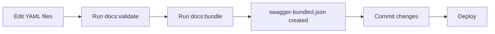

# 📚 API Documentation Structure

## 🎯 Overview

This folder contains the **source of truth** for all API documentation. The structure follows OpenAPI 3.0 standards with modular YAML files for maintainability and scalability.

---

## 📁 Folder Structure

```
docs/
├── index.yaml                 # 🎯 MASTER FILE - references all modules
├── components/                # Reusable OpenAPI components
│   ├── schemas.yaml          # Data models (User, Campaign, etc.)
│   ├── responses.yaml        # Common HTTP responses
│   ├── parameters.yaml       # Reusable URL/query parameters
│   └── security.yaml         # Authentication schemes
└── paths/                    # API endpoint definitions
    ├── auth.yaml             # Authentication endpoints
    ├── campaigns.yaml        # Campaign management endpoints
    ├── admin.yaml            # Admin-only endpoints
    └── collaborations.yaml   # (future) Collaboration endpoints
```

---

## ✅ Core Principles

### 🟢 **ALWAYS EDIT** (Source of Truth)
- ✏️ `docs/index.yaml` - Master file
- ✏️ `docs/components/*.yaml` - Schemas, responses, parameters
- ✏️ `docs/paths/*.yaml` - Individual endpoint definitions

### 🔴 **NEVER EDIT MANUALLY**
- ❌ `swagger-bundled.json` - Auto-generated by build script
- ❌ This file is regenerated on every build

---

## 🚀 Quick Start

### 1️⃣ Install Dependencies

```bash
npm install -g @apidevtools/swagger-cli
npm install -g @stoplight/spectral-cli
```

### 2️⃣ Bundle Documentation

```bash
# Generate bundled JSON from YAML sources
npm run docs:bundle

# Validate OpenAPI spec
npm run docs:validate

# Lint for best practices
npm run docs:lint

# Auto-rebuild on file changes (dev mode)
npm run docs:watch
```

---

## 📝 How to Add New Endpoints

### Step 1: Choose the correct domain file

| Domain | File | Examples |
|--------|------|----------|
| Authentication | `paths/auth.yaml` | Login, signup, sessions |
| Campaigns | `paths/campaigns.yaml` | Create/update campaigns |
| Admin | `paths/admin.yaml` | User management, logs |
| Collaborations | `paths/collaborations.yaml` | Influencer partnerships |

### Step 2: Add endpoint definition

Edit the appropriate file in `docs/paths/`:

```yaml
paths:
  /api/your/endpoint:
    post:
      tags:
        - YourTag
      summary: Brief description
      description: Detailed description
      security:
        - bearerAuth: []
      requestBody:
        required: true
        content:
          application/json:
            schema:
              type: object
              properties:
                field:
                  type: string
      responses:
        '200':
          description: Success
          content:
            application/json:
              schema:
                $ref: '../components/schemas.yaml#/schemas/YourSchema'
        '401':
          $ref: '../components/responses.yaml#/responses/UnauthorizedError'
```

### Step 3: Register endpoint in index.yaml

Add the path reference:

```yaml
paths:
  /api/your/endpoint:
    $ref: './paths/yourfile.yaml#/paths/~1api~1your~1endpoint'
```

**Note:** URL path separators `/` are encoded as `~1` in JSON Pointer notation.

### Step 4: Rebuild bundle

```bash
npm run docs:bundle
```

---

## 🔧 Adding New Schemas

Edit `docs/components/schemas.yaml`:

```yaml
schemas:
  YourNewModel:
    type: object
    required:
      - id
      - name
    properties:
      id:
        type: integer
      name:
        type: string
      createdAt:
        type: string
        format: date-time
```

Reference it in endpoints:

```yaml
schema:
  $ref: '../components/schemas.yaml#/schemas/YourNewModel'
```

---

## 🛠️ Best Practices

### ✅ DO:
- Edit YAML files in `docs/` folder
- Use `$ref` to avoid duplication
- Run `npm run docs:validate` before committing
- Add descriptions to all endpoints
- Include example values in schemas
- Use semantic HTTP status codes

### ❌ DON'T:
- **Never edit `swagger-bundled.json` directly**
- Don't duplicate schemas (use $ref)
- Don't commit without validating
- Don't use inline schemas for reusable models

---

## 🔍 Validation & Linting

```bash
# Check if OpenAPI spec is valid
npm run docs:validate

# Check for best practice violations
npm run docs:lint
```

Common validation errors:
- Missing required fields
- Invalid $ref paths
- Incorrect HTTP status codes
- Missing security definitions

---

## 🔗 Reference Format Examples

### Schema Reference
```yaml
$ref: '../components/schemas.yaml#/schemas/User'
```

### Response Reference
```yaml
$ref: '../components/responses.yaml#/responses/UnauthorizedError'
```

### Parameter Reference
```yaml
$ref: '../components/parameters.yaml#/parameters/PageNumber'
```

### Path Reference (in index.yaml)
```yaml
/api/auth/login:
  $ref: './paths/auth.yaml#/paths/~1api~1auth~1login'
```

---

## 📦 Production Deployment

The bundled file is automatically generated before starting the server:

```json
// package.json
"scripts": {
  "prestart": "npm run docs:bundle",
  "start": "node server.js"
}
```

This ensures the Swagger UI always serves the latest documentation.

---

## 🐛 Troubleshooting

### Issue: "$ref could not be resolved"
**Solution:** Check file path is relative and uses forward slashes `/`

### Issue: "Validation failed"
**Solution:** Run `npm run docs:validate` to see detailed errors

### Issue: "Bundle command not found"
**Solution:** Install swagger-cli globally: `npm install -g @apidevtools/swagger-cli`

---

## 📊 Workflow Summary



---

## 👥 Team Guidelines

1. **Before adding endpoints:**
   - Check if the domain file exists
   - Follow naming conventions (kebab-case for paths)
   - Add proper descriptions and examples

2. **Before committing:**
   - Run `npm run docs:validate`
   - Run `npm run docs:lint`
   - Test in Swagger UI locally

3. **Code review checklist:**
   - ✅ No manual edits to swagger-bundled.json
   - ✅ All endpoints have security definitions
   - ✅ All schemas are properly referenced
   - ✅ Validation passes without errors

---

## 📚 Resources

- [OpenAPI 3.0 Specification](https://swagger.io/specification/)
- [Swagger CLI Documentation](https://github.com/APIDevTools/swagger-cli)
- [Spectral Linting Rules](https://stoplight.io/open-source/spectral)
- [JSON Pointer Notation](https://datatracker.ietf.org/doc/html/rfc6901)

---

## 🔐 Security Note

Ensure sensitive information (API keys, secrets) is **never** included in:
- Example values
- Descriptions
- Schema defaults

Use environment variables in actual implementation.
